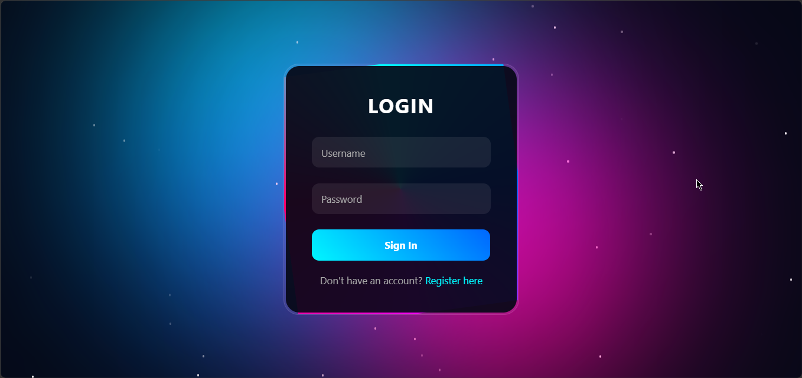

# Futuristic Login Page with HTML CSS & JavaScript

A sleek and modern login page built using pure HTML, CSS, and JavaScript. This project showcases a futuristic neon interface combined with animated glowing effects, floating particles, and interactive elements, creating a visually appealing and responsive user experience.

## 📸 Preview



## ✨ Features

* Futuristic Neon UI
* Animated Glowing Border
* Floating Particle Background
* Responsive Design
* Floating Input Labels
* Smooth Hover Effects
* Interactive Sign In Button
* Built with Pure HTML, CSS & JavaScript

## 🛠️ Built With

* HTML5
* CSS3
* JavaScript

## 📂 Project Structure

```text
Futuristic-Login-Page-with-HTML-CSS-and-JavaScript/
│
├── index.html
├── preview.png
└── README.md
```

## 🚀 Getting Started

### Clone the Repository

```bash
git clone https://github.com/Jeremykoresh/Futuristic-Login-Page-with-HTML-CSS-and-JavaScript.git
```

### Open the Project

Simply open the `index.html` file in your preferred web browser.

No installation or dependencies are required.

## 🎨 Customization

You can easily customize:

* Neon colors
* Glow effects
* Animation speed
* Particle effects
* Typography
* Button styles
* Background effects

## 💡 Learning Objectives

This project is suitable for developers who want to learn:

* CSS Animations
* Glassmorphism Design
* Responsive Layout Techniques
* Modern UI Styling
* JavaScript Interactions
* Interactive Login Form Design

## 📱 Responsive Design

The layout is designed to work across various screen sizes, including desktop, tablet, and mobile devices.

## ⭐ Support

If you found this project helpful, consider giving it a star on GitHub.

## 👨‍💻 Author

Jeremy Koresh

GitHub: https://github.com/Jeremykoresh

## 📄 License

This project is available for educational and personal learning purposes.
